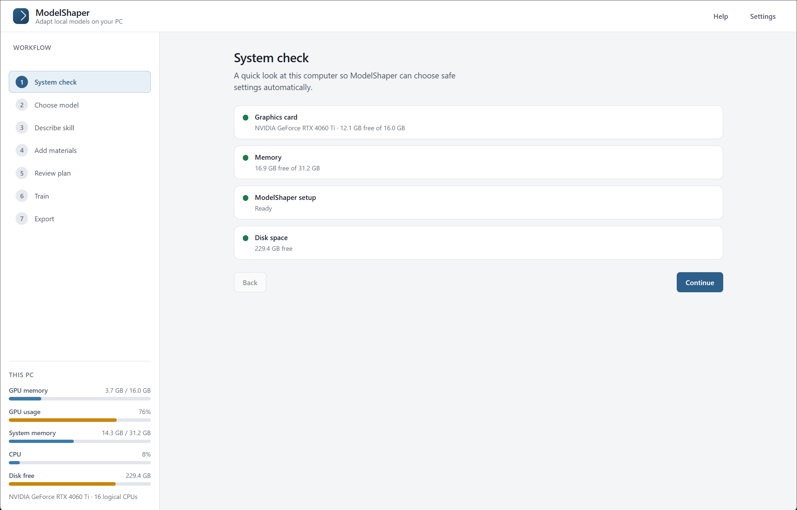
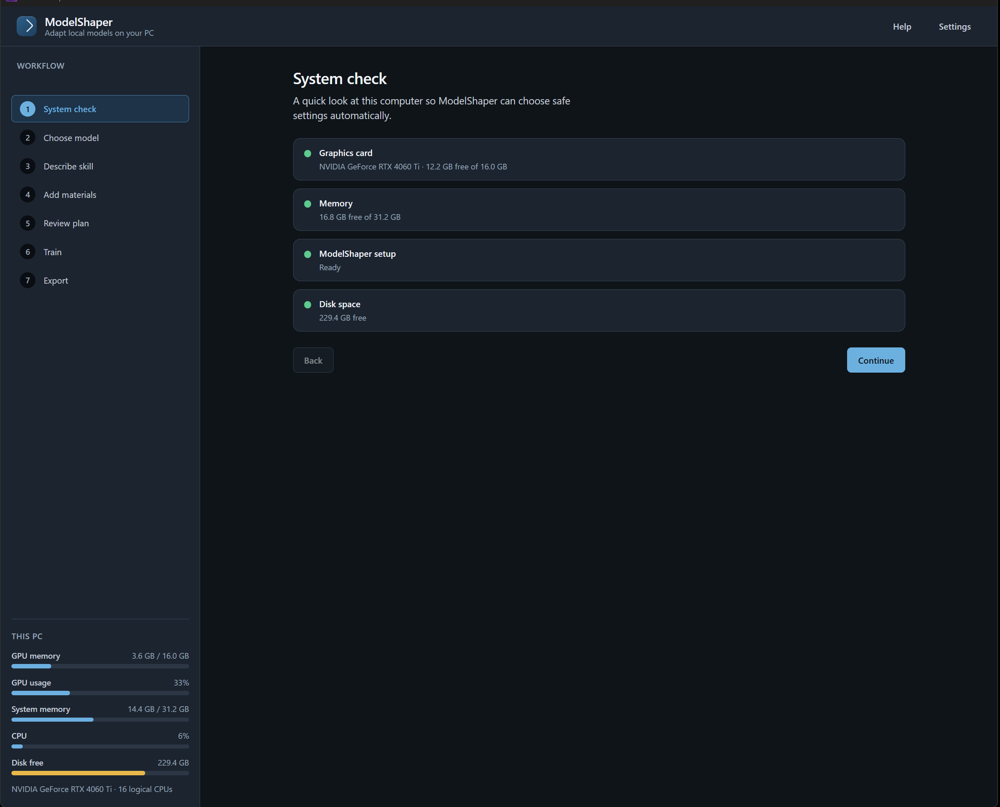
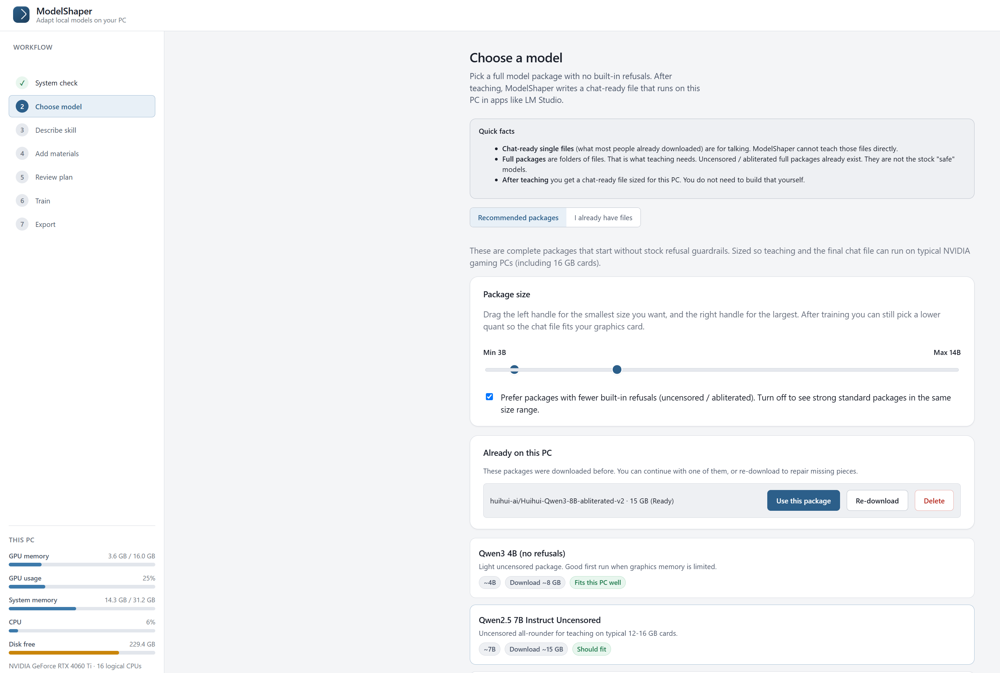
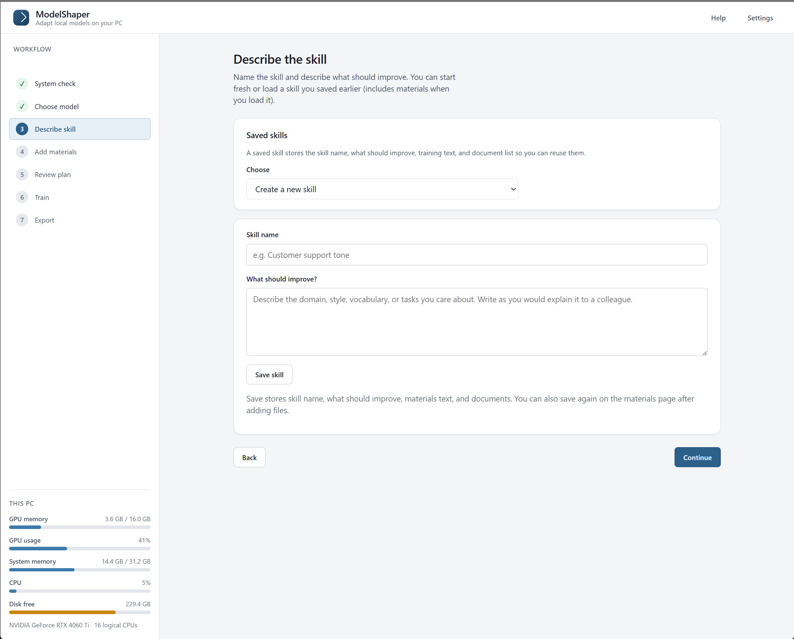
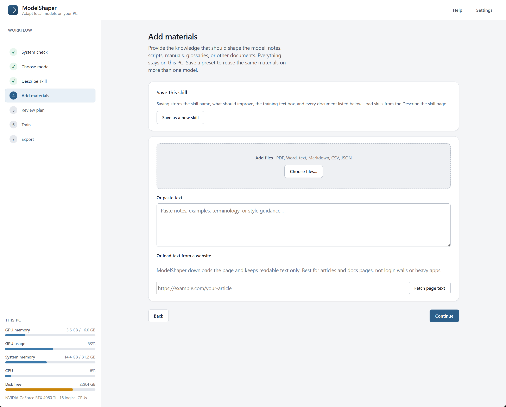
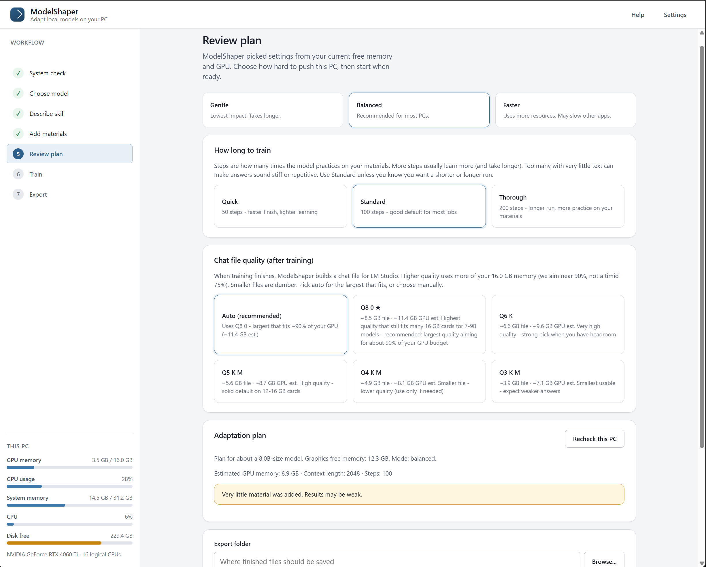
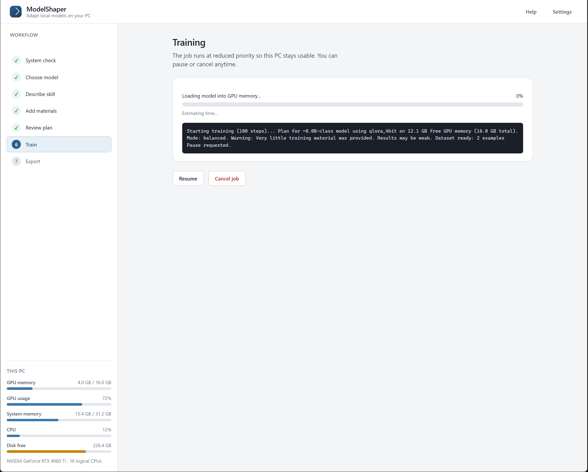
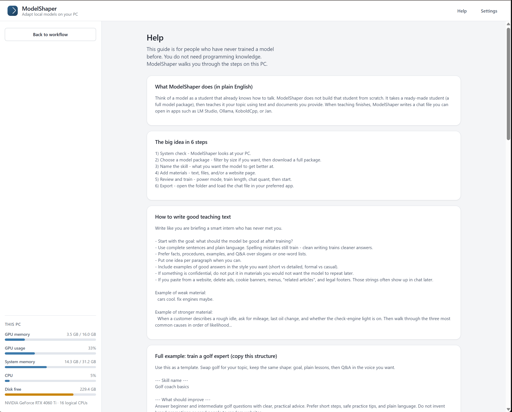
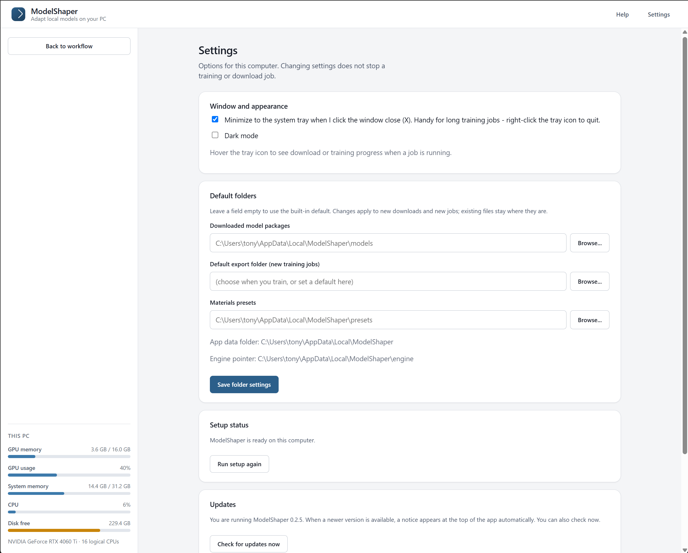

# ModelShaper

Train a local AI model using your own notes and documents, on your own Windows PC. 
 When the training finishes, you will get a GGUF file that you can open in LM Studio, Ollama, KoboldCpp, Jan, or any other option that is GGUF compatible. 

All work stays on your local computer. 

**License:** Free for **non-commercial** use when this project is made public. 
Commercial use needs permission from the author. See [LICENSE](LICENSE).

## Screenshots

With Dark Mode Enabled:

## Downloads (v0.2.11)

Pick **one** from [Releases](../../releases):

| File | Use this if |
|------|-------------|
| **ModelShaper-Setup.exe** | You want a normal Windows install (Start menu; data under your user profile) |
| **ModelShaper.msi** | Your IT prefers MSI installers |
| **ModelShaper.exe** | You want a portable app (put the EXE in any folder; data stays next to it) |

## There are a couple prerequisites to install before use.

1. This application has only been tested on Windows 10 and Windows 11.
2. while most PCs already have **WebView2** (it comes with Microsoft Edge). If the application will not open, install the Evergreen runtime:
- [WebView2 Evergreen Runtime](https://developer.microsoft.com/en-us/microsoft-edge/webview2/?form=MA13LH#download)

3. Python 3.10 or newer

   1. Open [python.org/downloads](https://www.python.org/downloads/).
   2. Download the latest **Windows installer (64-bit)**.
   3. Run it.
   4. On the first screen, check **Add python.exe to PATH**.
   5. Click **Install Now** and finish.
   6. Close and reopen any open terminals or apps.
To check it worked: open **Command Prompt**, type `python --version`, and press Enter. 
You should see something like `Python 3.12.x` or `3.13.x`.

4. NVIDIA graphics driver (This application only runs on NVIDIA Graphics cards running NVIDIA drivers)
Need an updated driver:
   1. Go to [NVIDIA Driver Downloads](https://www.nvidia.com/Download/index.aspx).
   2. Choose your GPU (or use automatic detection).
   3. Download and install the **Game Ready** or **Studio** driver.
   4. Restart if Windows asks you to.

5. Disk space and internet *

- I recommend that you maintain space equal to about 3 times the size of of the downloaded model on your hard drive.
- * Internet is used for the first-time setup (to add any missing training libraries) and optionally for downloading models on the model selection page.

## Install

### Option A: Setup installer

1. Download `ModelShaper-Setup.exe` from Releases.
2. Run it and follow the prompts.
3. Open **ModelShaper** from the Start menu.

Data (models, settings, engine pointer) defaults to:
`C:\Users\<you>\AppData\Local\ModelShaper\`
You can change the location in settings.

### Option B: Portable EXE

1. Create a folder, for example `D:\ModelShaper\`.
2. Put `ModelShaper.exe` in that folder.
3. Double-click `ModelShaper.exe`.
The portable version will create a small folder structure in this folder. 
You can change the location in settings.

## First setup (what you will see)

1. Open ModelShaper.
2. If you are opening ModelShaper for the first time, you will get a **Welcome / setup** screen.
3. Click **Set up ModelShaper**.
4. This may take a little while, and you may see a download of a few GB if training libraries are not already installed.
5. When it says you are ready, click **Continue** after which the folder structure will be created and the install setup will finish.
   (This will happen on both the stand alone and the full installed version)

If setup says Python was not found, install Python with PATH checked (see above), then open ModelShaper again.

## Teaching a model 
First Time Users are strongly advised to read through the Help section before training a model.

1. **System check** – confirm GPU memory is sufficient to load the model in to GPU Memory.
2. **Choose model** – A list will be provided that you can select from, or you can pick a folder you already have. (You need the full model package, not a GGUF file.)
3. **Describe the skill** – what should improve.
4. **Add materials** – paste text and/or attach files. If you paste from a website, delete ads, menus, and cookie banners first.
5. **Review** – Select how much of your computers resources will be used, the training length, Output file quant and export folder.
6. **Train** – watch the log. You can pause or cancel at any time.
7. **Export** – open the folder and load the `.gguf` in LM Studio or another chat app. Suggested chat settings will be provided on this page (temperature about 0.65 is a good start).

The Help section includes a **golf coach** example that you can use as a template for your own training session.

## Privacy

Documents, models, and training stay on your PC. 

## Version

Current release: **0.2.11**
